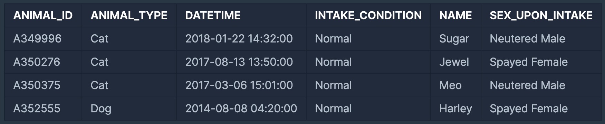

### GROUP BY



<hr/>
✍🏻[고양이와 개는 몇마리 있을까?]
: 동물 보호소에 들어온 동물 중 고양이와 개가 각각 몇 마리인지 조회하는 SQL문을 작성해주세요. 이때 고양이가 개보다 먼저 조회해주세요.

```
SELECT ANIMAL_TYPE, COUNT(ANIMAL_TYPE)
FROM ANIMAL_INS
GROUP BY ANIMAL_TYPE
ORDER BY ANIMAL_TYPE
```
<hr/>
✍🏻[동명 동물 수 찾기]
: 동물 보호소에 들어온 동물 이름 중 두 번 이상 쓰인 이름과 해당 이름이 쓰인 횟수를 조회하는 SQL문을 작성해주세요. 이때 결과는 이름이 없는 동물은 집계에서 제외하며, 결과는 이름 순으로 조회해주세요.

```
SELECT NAME, COUNT(NAME)
FROM ANIMAL_INS
GROUP BY NAME
HAVING COUNT(NAME) >=2
ORDER BY NAME

```
<hr/>
✍🏻[입양 시각 구하기(1)]
: 보호소에서는 몇 시에 입양이 가장 활발하게 일어나는지 알아보려 합니다. 9시부터 19시까지, 각 시간대별로 입양이 몇 건이나 발생했는지 조회하는 SQL문을 작성해주세요. 이때 결과는 시간대 순으로 정렬해야 합니다.

```
SELECT HOUR(DATETIME), COUNT(DATETIME)
FROM ANIMAL_OUTS
WHERE HOUR(DATETIME) BETWEEN 9 AND 19
GROUP BY HOUR(DATETIME)
ORDER BY HOUR(DATETIME)
```
<hr/>
✍🏻[입양 시각 구하기(2)]⭐️
: 보호소에서는 몇 시에 입양이 가장 활발하게 일어나는지 알아보려 합니다. 0시부터 23시까지, 각 시간대별로 입양이 몇 건이나 발생했는지 조회하는 SQL문을 작성해주세요. 이때 결과는 시간대 순으로 정렬해야 합니다.
(데이터에는 9-19까지의 시간대밖에 없는 상황)

```
SET @hour = -1;
SELECT
(@hour := @hour +1) AS HOUR,
(SELECT COUNT(*) FROM ANIMAL_OUTS WHERE HOUR(DATETIME) = @hour) AS COUNT
FROM ANIMAL_OUTS
WHERE @hour < 23
```
