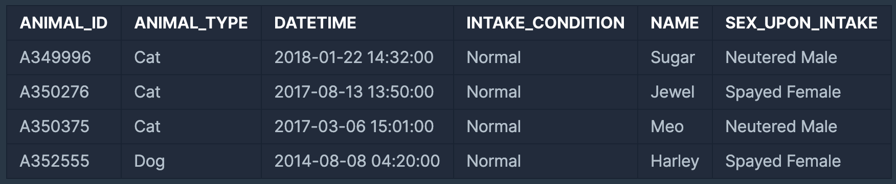

### SUM, MAX, MIN



✍🏻[최댓값 구하기]
: 가장 최근에 들어온 동물은 언제 들어왔는지 조회하는 SQL 문을 작성해주세요.

```
SELECT DATETIME 
FROM ANIMAL_INS
ORDER BY DATETIME DESC
LIMIT 1
```
```
SELECT MAX(DATETIME) 
FROM ANIMAL_INS
```
<hr/>
✍🏻[최솟값 구하기]
: 동물 보호소에 가장 먼저 들어온 동물은 언제 들어왔는지 조회하는 SQL 문을 작성해주세요.

```
SELECT DATETIME
FROM ANIMAL_INS
ORDER BY DATETIME
LIMIT 1
```
```
SELECT MIN(DATETIME)
FROM ANIMAL_INS
```
<hr/>
✍🏻[동물 수 구하기]
: 동물 보호소에 동물이 몇 마리 들어왔는지 조회하는 SQL 문을 작성해주세요.

```
SELECT COUNT(*) 
FROM ANIMAL_INS
```
<hr/>
✍🏻[중복 제거하기]
: 동물 보호소에 들어온 동물의 이름은 몇 개인지 조회하는 SQL 문을 작성해주세요. 이때 이름이 NULL인 경우는 집계하지 않으며 중복되는 이름은 하나로 칩니다.

```
SELECT COUNT(DISTINCT(NAME)) FROM ANIMAL_INS
```

<hr/>
✍🏻[평균 구하기]

```
SELECT AVG(AGE) FROM MY_TABLE;
```
<hr/>
✍🏻[합계 구하기]

```
SELECT SUM(AGE) FROM MY_TABLE;
SELECT SUM(AGE+VAT) FROM MY_TABLE; //테이블의 AGE와 VT를 합한 
```
