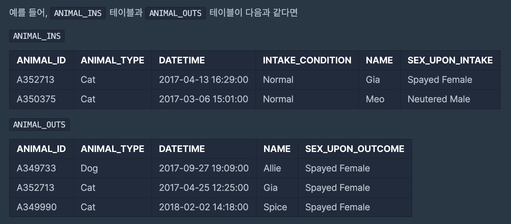

### SELECT



✍🏻 [루시와 엘라 찾기] -  IN
: 동물 보호소에 들어온 동물 중 이름이 Lucy, Ella, Pickle, Rogan, Sabrina, Mitty인 동물의 아이디와 이름, 성별을 조회하는 SQL 문을 작성해주세요.

```
SELECT ANIMAL_ID, NAME, SEX_UPON_INTAKE
FROM ANIMAL_INS
WHERE NAME IN ('Lucy','Ella','Pickle','Rogan','Sabrina','Mitty')
```
<hr/>
✍🏻 [이름에 el이 들어가는 동물 찾기] - LIKE %
: 보호소에 돌아가신 할머니가 기르던 개를 찾는 사람이 찾아왔습니다. 이 사람이 말하길 할머니가 기르던 개는 이름에 'el'이 들어간다고 합니다. 동물 보호소에 들어온 동물 이름 중, 이름에 EL이 들어가는 개의 아이디와 이름을 조회하는 SQL문을 작성해주세요. 이때 결과는 이름 순으로 조회해주세요. 단, 이름의 대소문자는 구분하지 않습니다.

```
SELECT ANIMAL_ID, NAME
FROM ANIMAL_INS
WHERE NAME LIKE '%el%'AND ANIMAL_TYPE = 'Dog'
ORDER BY NAME
```
<hr/>
✍🏻 [중성화 여부 파악하기]
: 보호소의 동물이 중성화되었는지 아닌지 파악하려 합니다. 중성화된 동물은 SEX_UPON_INTAKE 컬럼에 'Neutered' 또는 'Spayed'라는 단어가 들어있습니다. 동물의 아이디와 이름, 중성화 여부를 아이디 순으로 조회하는 SQL문을 작성해주세요. 이때 중성화가 되어있다면 'O', 아니라면 'X'라고 표시해주세요.

```
SELECT ANIMAL_ID, NAME, 
CASE WHEN SEX_UPON_INTAKE LIKE 'Intact%' THEN 'X'
ELSE 'O' END AS '중성화'
FROM ANIMAL_INS
```
<hr/>
✍🏻 [오랜 기간 보호한 동물(2)]
:  입양을 간 동물 중, 보호 기간이 가장 길었던 동물 두 마리의 아이디와 이름을 조회하는 SQL문을 작성해주세요. 이때 결과는 보호 기간이 긴 순으로 조회해야 합니다.

```
FROM ANIMAL_INS i
LEFT JOIN ANIMAL_OUTS o ON (i.ANIMAL_ID = o.ANIMAL_ID)
WHERE o.SEX_UPON_OUTCOME IS NOT NULL
ORDER BY (o.DATETIME - i.DATETIME) DESC
LIMIT 2
```
<hr/>
✍🏻 [DATETIME에서 DATE로 형 변환]
: ANIMAL_INS 테이블에 등록된 모든 레코드에 대해, 각 동물의 아이디와 이름, 들어온 날짜1를 조회하는 SQL문을 작성해주세요. 이때 결과는 아이디 순으로 조회해야 합니다.

```
SELECT ANIMAL_ID, NAME, DATE_FORMAT(DATETIME,'%Y-%m-%d') AS '날짜'
FROM ANIMAL_INS
ORDER BY ANIMAL_ID 
```
